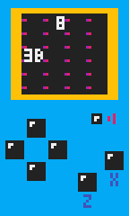

# PEEKPOKE

Tiny minimum retro fantasy console having only two commands: peek and poke.

## Sample game 'BOMB SNAKE'



Games for PEEKPOKE can be written in [simple JavaScript code](./docs/bombsnake/main.js). PEEKPOKE games [run in the browser](https://abagames.github.io/peekpoke/bombsnake/) of any PC or mobile device.

## Memory map


You can draw pixels or text by writing a number to a specific address in memory (poke), or get the input status of a key by reading a number from the address (peek).

## Sample snippets

### Draw a pixel

```JavaScript
// Draw a red pixel at (x, y).
poke(ADDRESS_VIDEO + x + y * VIDEO_WIDTH, COLOR_RED);
```

### Draw a text

```JavaScript
// Draw a 'A' text at (x, y).
poke(ADDRESS_TEXT + x + i + y * TEXT_WIDTH, "A",charCodeAt(0));
```

### Set text color

```JavaScript
// Make the text color green.
poke(ADDRESS_TEXT_COLOR + x + i + y * TEXT_WIDTH, COLOR_GREEN));
```

### Set text background color

```JavaScript
// Make the text background color blue.
poke(ADDRESS_TEXT_BACKGROUND + x + i + y * TEXT_WIDTH, COLOR_BLUE));
```

### Check keystroke status

```JavaScript
// Check if the up key is pressed.
if (peek(ADDRESS_KEY + KEY_UP) & KEY_STATE_IS_PRESSED) ...
// Check if the left key is just pressed.
if (peek(ADDRESS_KEY + KEY_LEFT) & KEY_STATE_IS_JUST_PRESSED) ...
// Check if the X key is just released.
if (peek(ADDRESS_KEY + KEY_X) & KEY_STATE_IS_JUST_RELEASED) ...
```

### Buzzer

```JavaScript
// Buzzer at 500 (50 x 10) Hz.
poke(ADDRESS_BUZZER, 50);
// Stop buzzer.
poke(ADDRESS_BUZZER, 0);
```

## Other sample games

- [DASH RACKET](https://abagames.github.io/peekpoke/dashracket/) ([code](./docs/dashracket/main.js))
